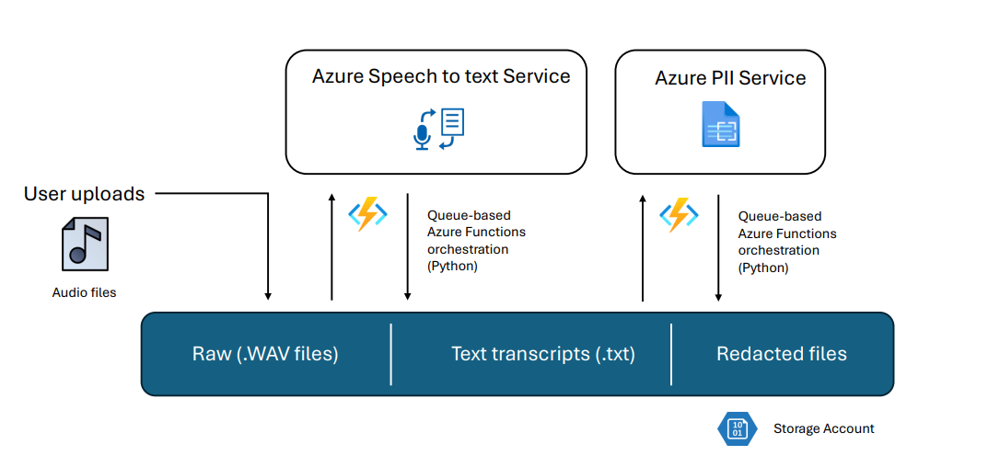

# Transcript Function Speech to Text

This is a Python Azure Function that convert audio files from Azure Blob Storage to text using Azure Speech Service.

Then the results are sent to OpenAI for redaction and the redacted results are stored in Azure Blob Storage.



## Prerequisites

- Python 3.11.9 or later
- Azure Functions Core Tools
- Azure CLI
- Azure Storage Account
- Azure Speech Service
- Azure Function App
- Azure Blob Storage

## Deployment Steps

Deploy the function to Azure Function, and configure the environment variables in the Azure Function App settings.

```text
RECORDINGS_STORAGE_ACCOUNT_NAME = "STORAGE ACCOUNT NAME WITHOUT .blob.core.windows.net"
RECORDINGS_CONTAINER = "BLOB CONTAINER NAME WHERE THE AUDIO FILES ARE"
TRANSCRIPTION_OUTPUT_CONTAINER = "BLOB CONTAINER NAME WHERE THE TRANSCRIPTIONS WILL BE DROPPED"
SPEECH_SUBSCRIPTION_KEY = "YOUR_SPEECH_SUBSCRIPTION_KEY REQUIRED FOR SPEECH SERVICE"
SPEECH_TO_TEXT_ENDPOINT = "https://REGION.api.cognitive.microsoft.com"
SA_OUTPUT_SAS = "SAS_TOKEN FROM STORAGE ACCOUNT THAT WILL BE USED BY SPEECH SERVICE TO DROP RESULTS AS CALLBACK"
OPENAI_COMPLETIONS_ENDPOINT = "https://YOUR_COMPLETIONS_SERVICE.cognitiveservices.azure.com"
COMPLETIONS_SUBSCRIPTION_KEY = "YOUR_COMPLETIONS_SUBSCRIPTION_KEY"
OPENAI_COMPLETIONS_MODEL = "gpt-35-turbo"
LANGUAGE_SUBSCRIPTION_KEY = "YOUR_LANGUAGE_SUBSCRIPTION_KEY"
LANGUAGE_ENDPOINT = "https://YOUR_LANGUAGE_SERVICE.cognitiveservices.azure.com"
OUTPUT_REDACTED_CONTAINER = "BLOB CONTAINER NAME WHERE THE REDACTED TRANSCRIPTIONS WILL BE DROPPED"
REDACTED_STORAGE_ACCOUNT_NAME = "REDACTED RESULTS STORAGE ACCOUNT NAME WITHOUT .blob.core.windows.net""
OUTPUT_REDACTED_CONTAINER = "BLOB CONTAINER NAME WHERE THE REDACTED JSON WILL BE DROPPED"
```

## Additional Environment Variables

The following environment variables are required for the Azure Function App to run properly using managed identity without connection strings on the storage accounts:

```text
AzureWebJobsStorage__accountName = "STORAGE ACCOUNT NAME WITHOUT .blob.core.windows.net"
AzureWebJobsStorage__credential = "managedidentity" #exactly as it is
IngestAccount__blobServiceUri = "https://YOUR_STORAGE_ACCOUNT_NAME.blob.core.windows.net" # This is the storage account used by the function itself, the name IngestAccount is the connection string name used in the code
SCM_DO_BUILD_DURING_DEPLOYMENT = "1" # This is required to run the function in Azure Function App
ENABLE_ORYX_BUILD = "true" # This is required to run the function in Azure Function App
FUNCTIONS_WORKER_RUNTIME = "python" # This is required to run the function in Azure Function App
BUILD_FLAGS = "UseExpressBuild"
```
